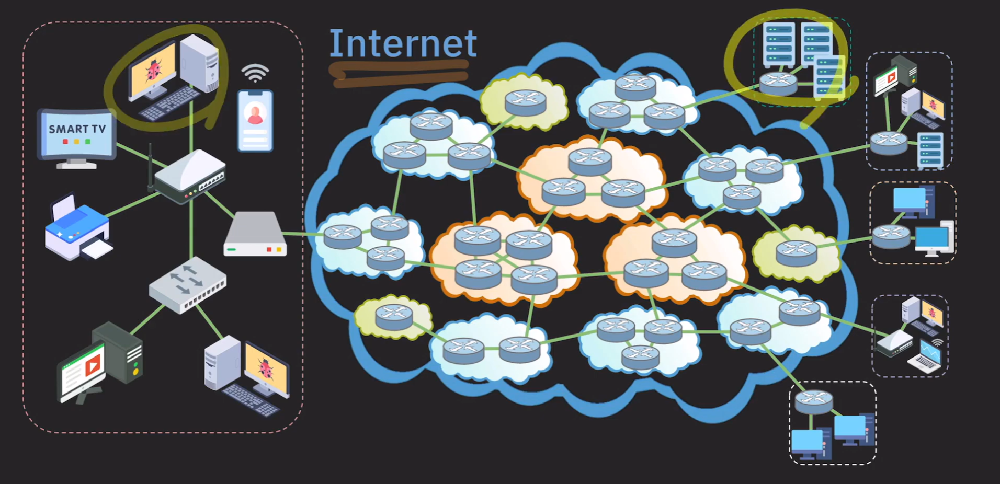

# Network
> 컴퓨터나 기기들이 리소스를 공유하거나 데이터를 주고받기 위해 우 뮤선으로 연결된 통신 체계

## LAN
> 제한된 범위 내에서 컴퓨터나 기기들을 연결해서 데이터나 리소스를 공유할 수 있게 하는 네트워크
1. Ethernet: 유선통신
2. Wireless LAN(WIFI): 무선통신

## WAN
> 여러 LAN 이나 다르 ㄴ종료유 의네트워크를 하나로 묶은 네트워크  
LAN 보다 더 넓은 범위

## Internet
> the world's largesg Network

* ISP(internet service provider) 가 인터넷을 제공(KT, SKT ..)
* 인터넷은 서로 여러 ISP들이 연결되어있는것

## ISP Tier
* tier 1 : 국제 범위의 네트워크 보유 -> 인터넷의 모든 네트워크 접근 가능 (인터넷 backbone)
    * 트래픽 전송 비용 x
* tier 2 : 국가/지방 범위 네트워크 보유 -> 일반 사용자나 기업 대상 서비스 (kt,skt ..)
    * tier 1 ISP에 비용을 내고 트래픽 전송
* tier 3 : 작은 지역 범위 서비스 제공
    * 상위 ISP에게 비용을 내고 인터넷 트개픽을 구매해서 서비스

### ISP 간에는 서로 Router로 연결 되어있음

## End system 
> Network 끝에 있는 node -> 리소스를 요청하는 쪽은 Client, 리소스를 제공하는 쪽은 Server