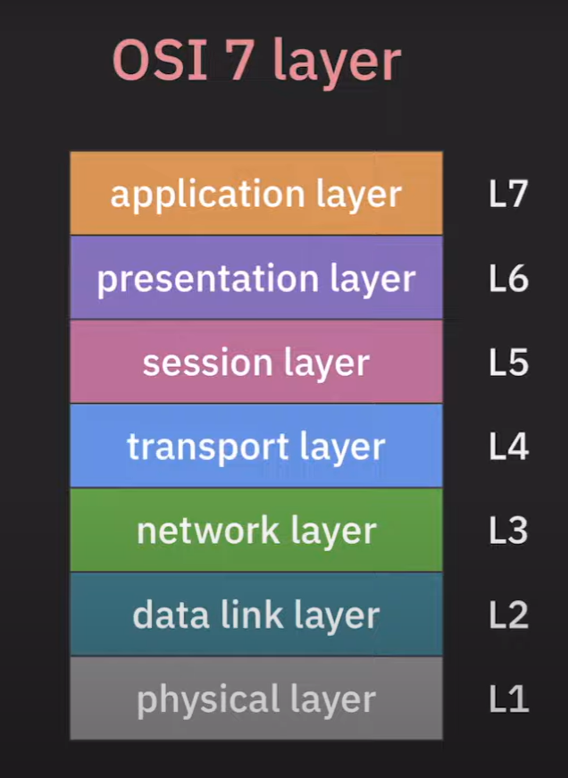
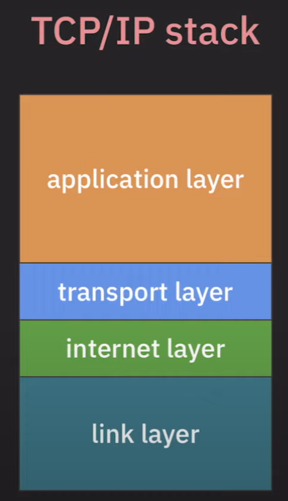

# OSI 7 Layer

> 네트워크의 기능들을 Layerd Architecture로 모델링 한 것.   

* 네트워크의 기능
1. Application 목적에 맞는 통신 방법제공
2. 신뢰할 수 있는 데이터 전송 방법 제공
3. 네트워크 간으 최적의 통신 경로 설정
4. 목적지로 데이터 전송
5. 노드 사이의 데이터 전송

* Network Layer Architecture 종류
1. OSI model (7 layer): 범용적인 네트워크 구조   
2. CP/IP stack (4 layer)

### Application Layer(7) : applicaion 목적에 맞는 통신 방법 제공
* HTTP,DNS,SMTP,FTP

### Presentation Layer(6) : Application 간의 통신에서 메시지 포맷관리
* 인코딩/디코딩

### Session Layer(5) : Application 간의 통신에서 세션을 관리
* RPC

### Transport Layer(4): 어플리케이션 간으 ㅣ통신 담당

* 목적지 Application으로 데이터 전송
* 안정적이고 신뢰할 수 있는 데이터 전송(TCP)
* 필수 기능만 제공(UDP)

### Network Layer(3) : Host간의 통신 담당(IP) 
* 네트워크 간의 최적의 경로 설정

### Data link Layer(2) : 직접 연결된 노드 간의 통신 담당
* Mac 주소 기반 통신(ARP)

### Physical layer(1) : bits 단위로 data 전송

# TCP/IP stack

> Internet에서 특화된 Layered Architecture

