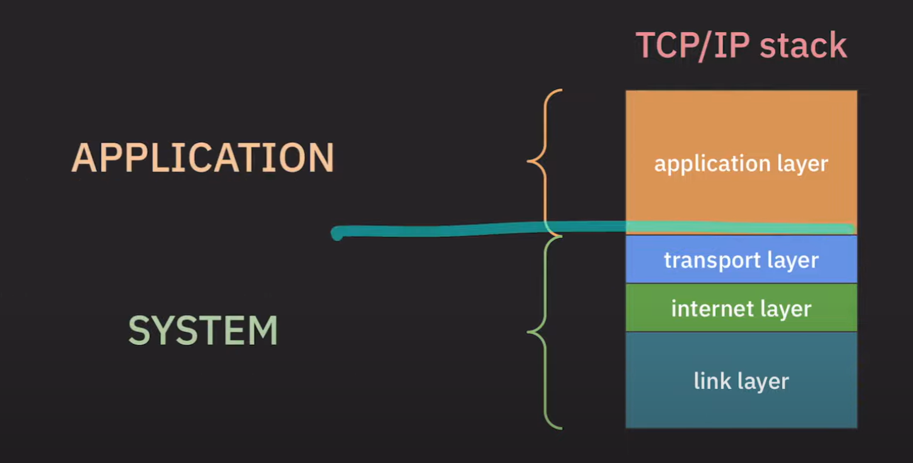
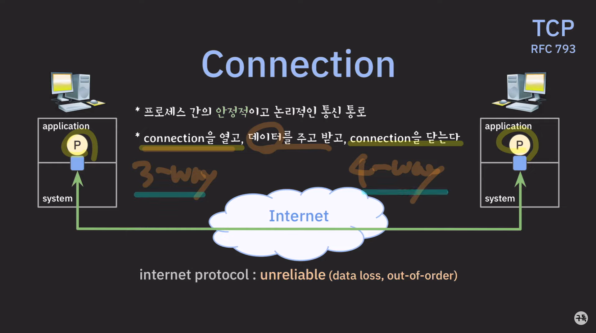
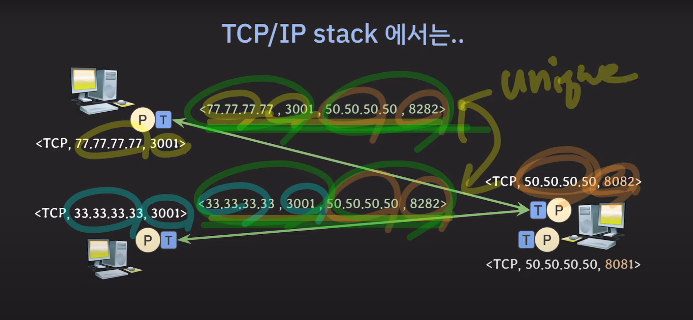
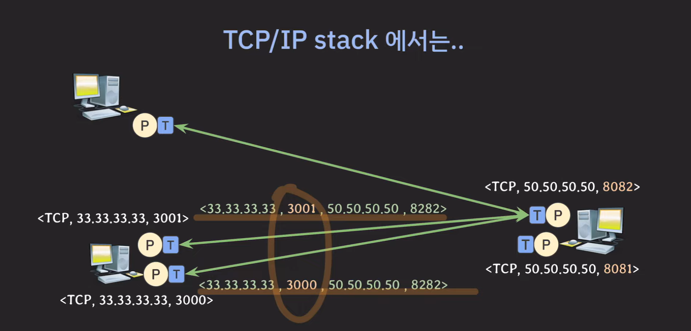
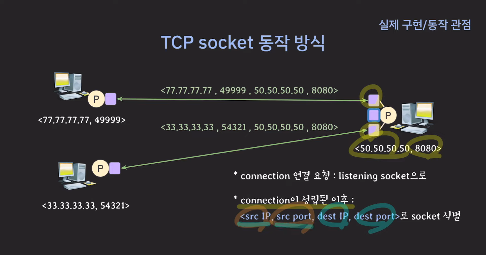

applicatoin(Process) 가 다른 Process와 통신하기위해 syestem과 연결된 Data Path

### Internet protocol : unreliable(신뢰할수없는) protocol -> data loss, out of order

-> process 간의통신에서 데이트럴 안정적으로 주고받을수있는 프로토콜이 필요

-> TCP!!!!

Port를 유니크하게 식별하기 위해 Port number 가 필요
host를 유니크하게 식별하기 위해 address 가 필요 ->IP

Socekt === internet addresss + port number

## Connection & Socket

* 각 connection은 유니크하게 식별되어야함
* 한 쌍의 socket은 connection을 유니크하게 식별

## UDP(user datagram protocol)

* connection : 연결을 맺지 않고 바로 데이터를 주고 받는다
* unreliable : IP를 거의 그대로 사용

## Socket
> System 이 Application에 제공하는 네트워크 인터페이스

-> 포트수는 제한되어있는데 어떻게 많은요청을 처리?
    1. 소켓은 client ip/clint port/server port/server ip 로 binding 즉 하나의 서버 포트에 여러 클라이언트가 연결가능(실제 구현상에서는 여러 listening socket과 새로 생성되는 소켓이다름
