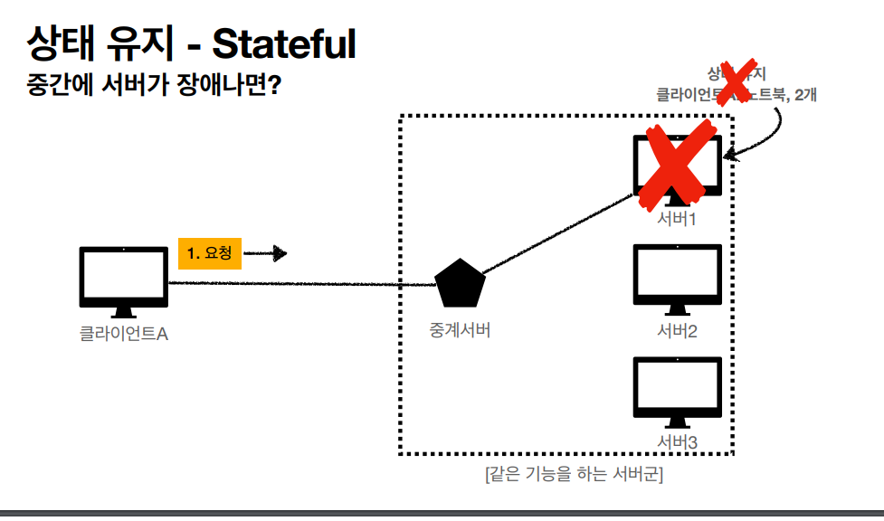
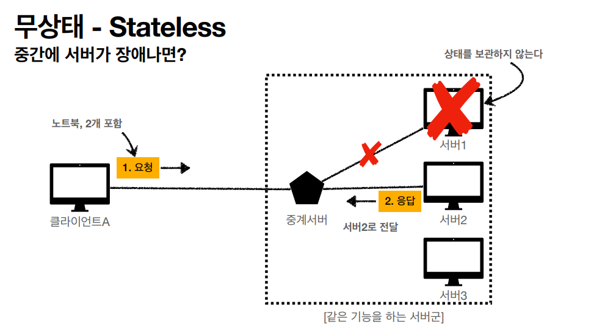
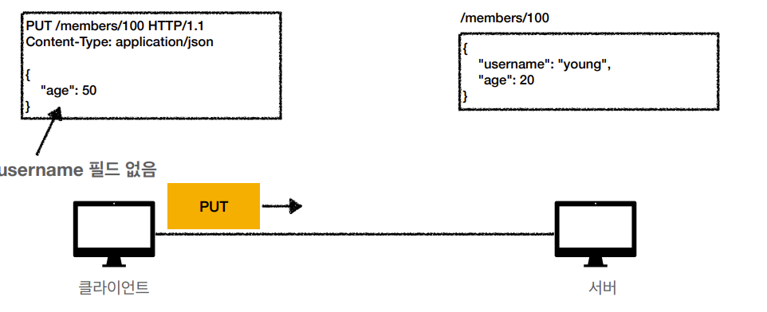
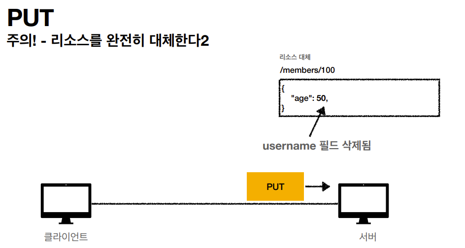

# Application Protocol

# 1. DNS
> DNS는 Domain Name System의 약자로, 사람이 읽을 수 있는 도메인 이름을 기계가 이해할 수 있는 IP 주소로 변환하는 시스템입니다. 웹 브라우저에 URL을 입력하면 DNS 서버는 해당 URL에 연결된 IP 주소를 찾아 반환하고, 브라우저는 이 IP 주소로 웹 서버에 연결을 시도합니다.

* DNS Lookup
> Forward DNS Lookup은 도메인 이름을 IP 주소로 변환하는 과정입니다. 반면, Reverse DNS Lookup은 IP 주소에서 시작하여 해당 IP 주소에 연결된 도메인 이름을 찾는 과정입니다. 루트 도메인 부터 시작해서 가까운 DNS 하위 도메인 네임 서버 에 요청하여 최종적으로 IP주소를 클라이언트에게 전달합니다

* DNS Spooping
> DNS 응답을 가로채서 가짜 IP를 클라이언트에게 전달하는 방법, DNSSEC(전자서명)을 사용해서 보호할수있다.

# 2. HTTP
> HyperText Transfer Protocol 로서 현재는 JSON IMG 음성등 거으 모든 종류의 데이터를 전송할수있음

* stateless
> 서버가 클라이언트의 상태를 보존하지 않음. scale out 하기 수월/ 클라이언트가 요청을 여러번 보내야해서 트래픽 증가

> 로그인일때는 Stateful 하게 설계해야할떄도있다(Session 방식) -> Token 방식으로 변경 or 중앙 Session storage

## 메시지 구조
---
   
GET /index.html HTTP/1.1 //start line   

Host: www.example.com  // http header   
User-Agent: Mozilla/5.0

HTTP/1.1 200 OK  //start line   
Content-Type: text/html //http header   
Content-Length: 123

1. start line
> HTTP 메소드/ 요청대상 /HTTP 버전 /상태 코드

2. HTTP Header
> HTTP 전송이 필요한 모든 부가 정보(Contents-length/ content-type 등등 )

3. Body
> 실제 전송할 데이터
   
   
## HTTP 메소드
---
### 1. GET
> 리소스 조회/ 서버에 전달하고싶은 데이터는 query로 전달가능 /body로도 전달이 가능하긴함

### 2. POST
> 요청 데이터 처리 / 메시지 바디를 통해 서버로 요청 데이터 전달/ 리소스 등록, 수정 

### 3. PUT
> 1. 리소스를 대체 : 리소스가 있으면 대체 없으면 생성   
> 2. 클라이언트가 리소스 위치를 알고 URI 지정 (POST와 차이점)    
> 주의점: 리소스를 완전히 대체함

### 3. DELETE
> 리소스를 제거

### HTTP 메소드의 특징
1. 안전(Safe Method)
2. 멱등(Idempotent)
3. 캐시가능

### 멱등(Idempotent)
1. 같은 요청을 여러번 보냈을 떄와 한번 보냈을떄 결과가 같은것을 의미
* POST와 PATCH는 여러번 보낼시 멱등이 보장되지 않음

* GET VS POST(캐시관점에서)
> 실제로는 GET, HEAD 정도만 캐시로 사용
      POST, PATCH는 본문 내용까지 캐시 키로 고려해야 하는데, 구현이 쉽지 않음

## HTTP 1 vs HTTP 2
멀티플렉싱(Multiplexing)은 여러 데이터 스트림을 하나의 채널에서 동시에 전송하는 방법을 의미합니다. 이를 통해 네트워크 리소스를 더 효율적으로 활용하고 전체적인 성능을 향상시킬 수 있습니다.

HTTP/2에서의 멀티플렉싱은 여러 요청과 응답 메시지를 하나의 TCP 연결 위에서 동시에 주고받을 수 있게 해줍니다. 각 요청과 응답은 별도의 '스트림'이라는 논리적인 통신 채널에 할당되며, 각 스트림은 고유한 식별자를 가집니다.

HTTP/1.1에서는 하나의 연결에서 한 번에 하나의 요청-응답 쌍만 처리할 수 있었습니다. 또한 요청-응답 쌍은 순차적으로 처리되어야 했으므로, 앞선 요청이 지연되면 그 뒤의 요청들도 모두 지연되는 현상(Head-of-Line blocking)이 발생했습니다.

반면 HTTP/2에서는 멀티플렉싱을 통해 여러 요청과 응답을 동시에 처리할 수 있습니다. 이를 통해 요청과 응답의 처리를 병렬화하여 전체적인 성능을 향상시킬 수 있습니다. 또한 하나의 요청이 지연되더라도 그 뒤의 요청들이 지연되지 않도록 할 수 있습니다.

이런 멀티플렉싱의 장점은 특히 네트워크 지연이 크거나 여러 자원을 요청해야 하는 웹 페이지 로딩 등에서 두드러집니다. 이를 통해 웹 페이지의 로딩 시간을 크게 줄일 수 있습니다.

## Cache
* 캐시 expires가 지나도 server에서 해당 데이터가 끝나지 않는다면 검증 헤더를 통해서 쿠키에 저장한 캐시를 계속 사용하게 가능.

