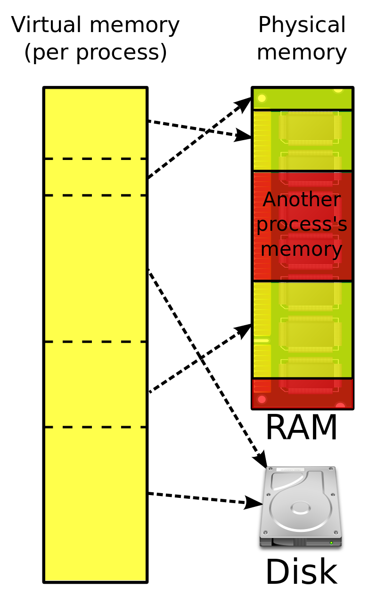
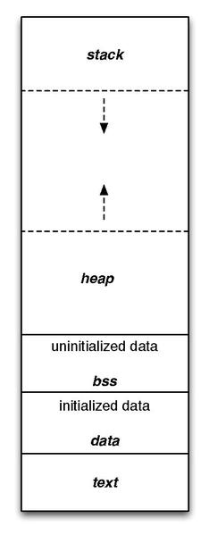

Virtual Memory(VM)은 물리 메모리(RAM) 용량을 초과해서 프로세스를 실행 할 수 있게 만드는 기술이다. 프로세스가 메모리에 접근할때 페이지를 물리 메모리에 lazy 하게 loading 한 후 가상화된 메모리와 맵핑하는 방식이다.

이번 글에서는 Vritual Memory에 대해 알아보려 한다. 특히 PintOS Project 3 코드를 통해 Virtual Memory에 할당방식을 살펴보자.

* 참고사항
	1. __KAIST PintOS Project3베이스로 작성된 글입니다. 하지만 Project 3 정답코드에 대한 설명은 포함 되어있지 않습니다.__ 
  	2. PintOS 프로젝트를 수행하지 않아도, PintOS 내용을 제외하고는 이해할 수 있는 글을 작성하는게 목표입니다.
  	3. PintOS 내용 부분은 직접 함수를 따라가면서 알게된 내용을 정리했습니다. 틀린부분이 있다면 댓글로 알려주시기 바랍니다.

* 목차
	1. Virtual Memory?
	2. 


# 1. Virtual Memory?

> [이미지 출처 위키백과(VirtualMemory)](https://en.wikipedia.org/wiki/Virtual_memory)

먼저 OS가 Virtual Memory를 제공하지 않는다고 가정하자. 그리고 다음과 같은 상황을 생각해보자.

1. RAM 16GB
2. Process 크기 4GB

Disk에 저장되어있던 프로그램은 __전부 RAM에 loading 된다__. 이후에 프로세스가 메모리에 접근시 RAM에 직접 접근한다. 

여기서 가정한 Process 크기는 4GB인데, 동일 크기에 Process를 최대 4개 까지 밖에 실행 하지 못하게 된다. 게다가 만약 Process 크기가 32GB 라면? 
그 Program은 실행조차 할 수 없게된다. 

이러한 문제를 해결 한 것이 Virtual Memory 기술이다. 
> 물론 VM은 process가 다른 process의 메모리에 접근하는것을 방지하는 protection으로서의 기능도 한다.

## Page Table 과 Virtual Memory
---




위 그림은 많이 봤을 process의 Memory 구조이다. 바로 이 그림이 OS 에서 제공하는 Virtual Memory라고 생각하면 된다! 

우리가 C언어에서 포인터를 사용해 접근하는 것은 __실제 메모리 주소가 아니다.__  위그림 과같은 가상화 메모리 주소에 접근하는 것이다. 그렇다면 가상화 메모리와 실제 물리메모리(RAM)은 어떻게 서로 맵핑되어 있는걸까?

OS는 Virtual Memory을 일정한 크기(일반적으로 4KB)로 나누어 관리한다. 이것을 Page라고 한다. 프로그램이 실행되면 OS는 프로그램의 메모리 요구사항 만큼 페이지를 생성하고 Page를 관리하는 __Page Table__ 에 등록한다.

Page Table 은 여러 플래그 비트 및 실제 물리 메모리 주소(Frame) 으로 이루어져 있다.
> PintOS에서 Page Table 역할을 하는 것은 pml4이다.

그렇다면 실제로 프로그램이 실행되어서 가상메모리가 실제 물리메모리에 할당 되고 해제 되는 대략적인 과정을 먼저 살펴보자.

1. Disk 에 존재하는 프로그램이 load 됨.

2. 먼저 프로그램의 code/data 영역이 메모리에 할당됨.

3. 프로그램의 다른 메모리 부분에 대해 가상메모리 즉 page가 할당되고 page table 에 등록됨.
	* 현재 page는 물리메모리(frame)에는 할당되지 못한 상태 

4. 프로그램이 실행되고(Process), process가 실행도중 특정 가상 메모리 주소에 접근할때 page table을 확인

5. 만약 가상메모리주소에 해당하는 page가 frame이 할당되어있지 않다면 page fault 발생

6. OS는 CPU는 Frame Table을 확인하여 _설정된 정책_ 에 맞게 Frame을 할당.

7. 다시 process 진행

여기서 주목해야 할점은 프로그램의 메모리가 실행되는시점에 전부 RAM으로 load 되지 않는다는것이다. 즉 프로세스가 어떤 메모리 주소에 접근할때야 비로소 Frame이 할당되며 RAM에 load 된다. 이것을 __Lazy Load__ 라고 한다.

또한 process가 메모리에 접근할때마다, OS가 페이지테이블을 확인하는 과정이있는데, 즉 process가 다른 process의 메모리나 잘못된 메모리 주소 접근을 방지할 수 있다.


# 2. PintOS virtual memory 동작 방식 

PintOS project 3 를 기반으로 vm 이 어떤식으로 동작하는지 살펴보자. 자세한 구현에 대해서는 설명을 생략하기 때문에 대략적인 흐름을 잡는데 도움이 됐으면 좋겠다.

먼저 기본적인 page와 frame 구조체 코드이다.

```c
struct page {
	const struct page_operations *operations;
	void *va;              /* Address in terms of user space */
	struct frame *frame;   /* Back reference for frame */

	/* Your implementation */
	struct hash_elem hash_elem; 
	bool writable;
	int page_count;
};

/* The representation of "frame" */
struct frame {
	void *kva;
	struct page *page;
	struct list_elem frame_elem;
};
```

page는 virtual address(va)와 할당된 frame을 필드로 갖고있다.   
frame은 kernel virtual address(kva) 즉 실제 물리 메모리주소 와 page를 필드로 갖고있다.

### 1. Disk 프로그램이 load 됨
```c
static bool
load (const char *file_name, struct intr_frame *if_) 
		`
		`
		

	/* Read program headers. */
	file_ofs = ehdr.e_phoff;
	for (i = 0; i < ehdr.e_phnum; i++) 
		struct Phdr phdr;

		if (file_ofs < 0 || file_ofs > file_length (file))
			goto done;
		file_seek (file, file_ofs);

		if (file_read (file, &phdr, sizeof phdr) != sizeof phdr)
				`
				`
				`
				// 페이지 loading 
					if (!load_segment (file, file_page, (void *) mem_page,
								read_bytes, zero_bytes, writable))
						goto done;
				`
				`
				`
	if (!setup_stack (if_))
		goto done;

	/* Start address. */
	if_->rip = ehdr.e_entry;

	/* TODO: Your code goes here.
	 * TODO: Implement argument passing (see project2/argument_passing.html). */
	

	success = true;
```

위는 PintOS load 함수에 일부이다. Disk에서 파일에 header 부분을 읽고(code, data) load_segment 함수를 호출해 page를 할당한다.

### 2. VM page가 할당됨

```c
static bool
load_segment(struct file *file, off_t ofs, uint8_t *upage,
			 uint32_t read_bytes, uint32_t zero_bytes, bool writable)
{
	ASSERT((read_bytes + zero_bytes) % PGSIZE == 0);
	ASSERT(pg_ofs(upage) == 0);
	ASSERT(ofs % PGSIZE == 0);

	while (read_bytes > 0 || zero_bytes > 0)
	{
		/* Do calculate how to fill this page.
		 * We will read PAGE_READ_BYTES bytes from FILE
		 * and zero the final PAGE_ZERO_BYTES bytes. */
		size_t page_read_bytes = read_bytes < PGSIZE ? read_bytes : PGSIZE;
		size_t page_zero_bytes = PGSIZE - page_read_bytes;

		struct lazy_load_arg *aux = (struct lazy_load_arg *)malloc(sizeof(struct lazy_load_arg));
		aux->file = file;
		aux->ofs = ofs;
		aux->read_bytes = page_read_bytes;
		aux->zero_bytes = page_zero_bytes;
		if (!vm_alloc_page_with_initializer(VM_ANON, upage, writable, lazy_load_segment, aux)){
			return false;
		}	

		read_bytes -= page_read_bytes;
		zero_bytes -= page_zero_bytes;
		upage += PGSIZE;
		ofs += page_read_bytes;
	}
	return true;
}

//vm.c 
bool vm_alloc_page_with_initializer(enum vm_type type, void *upage, bool writable,
									vm_initializer *init, void *aux)
{

	ASSERT(VM_TYPE(type) != VM_UNINIT)
	struct page *init_page;
	struct supplemental_page_table *spt = &thread_current()->spt;

	/* Check wheter the upage is already occupied or not. */
	if (spt_find_page(spt, upage) == NULL)
	{
		/* TODO: Create the page, fetch the initialier according to the VM type,
		 * TODO: and then create "uninit" page struct by calling uninit_new. You
		 * TODO: should modify the field after calling the uninit_new. */

		init_page = (struct page *)malloc(sizeof(struct page));
		page_initialized(init_page, pg_round_down(upage), init, type, aux);
		init_page->writable = writable;
		/* TODO: Insert the page into the spt. */
		return spt_insert_page(spt, init_page);
	}
err:
	return false;
}
```

load_segment 함수 내부에서 보이지만 앞서 말했듯이 RAM에 전체 프로그램 전체 메모리를 load 하지 않는다. 다만 vm_alloc_page_with_initiallizer()를 호출해서 프로그램 크기만큼 page를 할당하고있다.

여기서 supplemnetal page table은 pintos에서 사용하는 page 보조테이블로서 proess(thread) 커널 영역에 저장되어있고 page의 정보를 linked list로 관리하는 객체이다.

즉 page 구조체를 생성하고 supplemental page table 에 등록하는 과정이다

### 3. Page Fault

프레임에 할당되어있지 않는 주소에 접근시 OS는 Page Fault를 발생시킨다. 

```c
bool vm_try_handle_fault(struct intr_frame *f UNUSED, void *addr UNUSED,
						 bool user UNUSED, bool write UNUSED, bool not_present UNUSED)
{
	struct thread *current_thread = thread_current();
	struct supplemental_page_table *spt UNUSED = &current_thread->spt;
	struct page *page = NULL;

	/*syscall */
	/* TODO: Validate the fault */

	page = spt_find_page(spt, pg_round_down(addr));
	if (page == NULL)
	{
		return false;
	}
	if (write && page->writable == 0)
	{
		return false;
	}
	/* TODO: Your code goes here */
	return vm_claim_page(addr);
}
```
Page Fault 가 발생하면 OS는 vm_try_handle_fault를 호출한다(interrupt 과정은 포스팅에서 생략하겠다) 위는 vm_try_andle_fault 의 일부인데 addr가 가 supplent page table 에 존재하는 페이지 인지 확인하고 vm_claim_page()를 호출해 frame 을 할당한다.

> vm_claim_page는 frame 할당 정채에 따라 page와 frame 을 맵핑시키는 함수이다. frame 정책에 대해서는 다른 글에서 더 자세히 다루도록 하겠다.


	